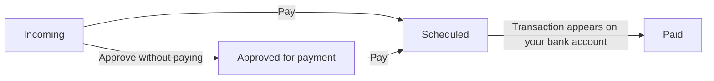

A purchase invoice moves through four states in Rise: **incoming → approved for payment → scheduled → paid**. All four live in the same **Payables** view, so you see at a glance what is waiting for you and what is already on its way to the bank.

<Frame caption="The Payables view: incoming, approved, scheduled, and paid invoices on one screen. Finnish interface shown.">
  
</Frame>

## The invoice lifecycle

| State | What it means | What moves it on |
| --- | --- | --- |
| **Incoming** | The invoice is in Rise, but nobody has handled it yet | You approve it |
| **Approved for payment** | The invoice is approved, but no payment has been set in motion | You send it for payment |
| **Scheduled** | The payment is scheduled and leaves on its due date | The bank executes the payment |
| **Paid** | The payment shows on your bank account | Nothing — the invoice is done |

The tabs at the top of the view — **All**, **Incoming**, **Approved**, **Scheduled**, and **Paid** — narrow the list to a single state. Each state shows its item count and total.

## Four ways an invoice reaches Rise

Use whichever is fastest at the time. They all land in the same **Incoming** list.

<Tabs>
  <Tab title="E-invoice">
    E-invoices arrive straight in the app. When a supplier sends an invoice to your company's e-invoicing address, it appears in Incoming already read. You forward nothing and open no attachments.

    This is the best way to receive invoices. Ask your suppliers for e-invoices whenever they can send them.
  </Tab>

  <Tab title="Magic Box">
    Upload the invoice as a file to Magic Box, and Rise reads it and turns it into a purchase invoice. This is how you handle PDF invoices that arrive as email attachments.
  </Tab>

  <Tab title="Phone share menu">
    When an invoice is open on your phone — as an email attachment, in the browser, or in a supplier's own app — tap **Share** and choose **Rise**. The invoice moves into Rise without you saving the file first.
  </Tab>

  <Tab title="Created by hand">
    Create a purchase invoice yourself from the **Purchase invoices** menu. You rarely need this — only when no electronic invoice exists at all.
  </Tab>
</Tabs>

## Approval and payment

Approval and payment happen in the same **Pay** action. Open an invoice from Incoming and tap **Pay**. You see the invoice details and can change two things before you confirm.

<CardGroup cols={2}>
  <Card title="Payment account" icon="building-columns">
    Choose which bank account the payment leaves from. If your company has several accounts in Rise, switch account here.
  </Card>

  <Card title="Due date" icon="calendar">
    Change the day the payment leaves. Bring it forward to pay immediately, or push it out when cash flow says so.
  </Card>
</CardGroup>

Once you confirm, the invoice moves to **Scheduled** and waits for its due date.

### Approve without paying

You can also approve an invoice without setting a payment in motion. It then moves to **Approved for payment** and stays there until someone sends it for payment. Do this when the invoice itself is fine but someone else decides when it gets paid.

## Payment and reconciliation

A scheduled payment leaves for the bank on its due date. After that you do nothing: **the invoice is marked paid automatically once the transaction appears on your bank account.** Rise matches the transaction to the invoice and moves it to Paid.

<Note>
  Reconciliation is not instant. Transactions are fetched from your bank four times a day, so a paid invoice can still show as Scheduled for a few hours after the payment date. See [Bank Connections](/features/bank-connections).
</Note>

## Before payments work

Receiving invoices, approving them, and getting them into the books works from day one. Sending a payment to the bank needs a separate **payment mandate** — a bank connection agreement and a power of attorney, which take the bank 1–3 weeks to process. A PSD2 bank connection is read access only and never moves money.

Start the mandate early even though you use it last. The steps are on [Connect Bank](/support/connect-bank) under _Enable payments_.

<Warning>
  If an invoice is approved but the payment never leaves, the payment mandate is not active yet. Contact us and we will tell you where the paperwork stands.
</Warning>

## Related pages

<CardGroup cols={2}>
  <Card title="Connect Bank" icon="bank" href="/support/connect-bank">
    Read access and the payment mandate — two separate things that move at different speeds.
  </Card>

  <Card title="Expenses" icon="receipt" href="/features/expenses">
    Receipts and expense claims. A purchase invoice comes from a supplier; an expense starts from your own purchase.
  </Card>

  <Card title="AI Bookkeeping" icon="bolt" href="/features/ai-bookkeeping">
    What the AI does with an invoice once it has been approved.
  </Card>

  <Card title="Mobile App" icon="mobile-iphone" href="/features/mobile-app">
    Approvals, receipt capture, and the rest of Rise on your phone.
  </Card>
</CardGroup>
