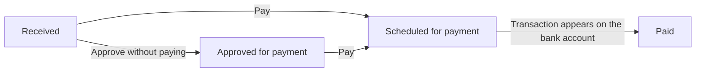

A purchase invoice moves through four states in Rise: **received → approved for payment → scheduled for payment → paid**. All four live in the same **Payables** view, so one glance tells you what is waiting for you and what is already on its way to the bank.

## The invoice lifecycle

| State | What it means | What moves it on |
| --- | --- | --- |
| **Received** | The invoice is in Rise but has not been handled | You approve it |
| **Approved for payment** | Approved, but no payment has been released | Someone releases the payment |
| **Scheduled for payment** | The payment is scheduled and leaves on the due date | The bank executes the payment |
| **Paid** | The payment shows on the bank account | Nothing — the invoice is done |

The tabs at the top of the view — **All**, **Received**, **Approved**, **Scheduled** and **Paid** — narrow the list to one state. Each state shows its item count and total.

## How an invoice reaches Rise

There are five ways. Use whichever is fastest at the time — they all land in the same **Received** list.

<Tabs>
  <Tab title="E-invoice">
    E-invoices arrive straight in the app. When a supplier sends an invoice to your company's e-invoicing address, it appears in Received already read. Nothing to forward, no attachments to open.

    This is the best way to receive invoices. Ask your suppliers for e-invoices wherever it is possible.
  </Tab>
  <Tab title="Scanning service">
    Paper invoices go through the scanning service. The supplier sends the invoice to the scanning address, the service scans and interprets it, and the invoice appears in Received exactly like an e-invoice.

    Redirect paper invoices to the scanning address once, and you never handle them by hand again.
  </Tab>
  <Tab title="Magic Box">
    Upload the invoice as a file into the app's **Magic Box**, and Rise reads it and turns it into a purchase invoice. This is how you handle one-off PDF invoices.
  </Tab>
  <Tab title="Phone share menu">
    When an invoice is open on your phone — as an email attachment, in the browser, or in a supplier's own app — choose **Share** and then **Rise**. The invoice moves into Rise without you saving the file first.
  </Tab>
  <Tab title="Email forwarding">
    Forward the email carrying the invoice to your company's Rise address. Rise reads the attachments and turns them into purchase invoices.

    When invoices always land in the same mailbox, set up a forwarding rule once — after that they move into Rise on their own.
  </Tab>
</Tabs>

A purchase invoice can also be created by hand from the **Purchase Invoices** menu. You will rarely need it: only when the invoice exists in no electronic form at all.

## Approval flow and releasing payment

A received invoice enters the approval flow. Who approves invoices and within what limits is agreed during onboarding, and the approver gets a notification on mobile.

Approving and releasing payment are two separate things, and you can do them separately or in one go:

<CardGroup cols={2}>
  <Card title="Approve and pay at once" icon="bolt">
    **Pay** approves the invoice and releases the payment in a single step. The fastest route, and it works from mobile.
  </Card>

  <Card title="Approve now, pay later" icon="circle-check">
    The invoice stays in **Approved for payment** until someone releases the payment. Use this when the invoice is sound but someone else decides when it is paid.
  </Card>
</CardGroup>

Open the invoice from Received and tap **Pay**. You see the invoice details and can change two things before you confirm.

<CardGroup cols={2}>
  <Card title="Paying account" icon="building-columns">
    Choose which bank account the payment leaves from. If your company has several accounts in Rise, switch here.
  </Card>

  <Card title="Due date" icon="calendar">
    Change the day the payment leaves. Bring it forward to pay now, or push it out when cash flow says so.
  </Card>
</CardGroup>

Once you confirm, the invoice moves to **Scheduled for payment** and waits for its due date.

### Dimensions are tagged automatically

When dimensions are in use, Rise tags the invoice lines automatically, following the guidance recorded in your dimension settings. The approver does nothing.

The tagging can be corrected by hand line by line — at approval or afterwards — and one invoice can split across several projects or cost centres.

<Tip>
  See [Dimensions](/features/dimensions): how axes and values are created, how a line is split across several values, and where to see what was left untagged.
</Tip>

## Payment and clearing

A scheduled payment leaves for the bank on its due date. After that you do nothing: **the invoice clears itself as paid once the transaction shows on the bank account.** Rise matches the transaction to the invoice and moves it to Paid.

<Note>
  Clearing is not instant. Transactions are fetched from the bank four times a day, so a paid invoice can sit in Scheduled for a few hours after the payment date. See [Bank Connections](/features/bank-connections).
</Note>

## Before paying works

Receiving, approving and booking invoices work immediately. Sending a payment to the bank requires a separate **payment mandate** — a bank connection agreement and a power of attorney, which take 1–3 weeks to process at the bank. The PSD2 connection is read-only and moves no money.

Start the mandate early, even if you only use it last. The instructions are on [Connect Bank](/support/connect-bank) under _Enable payments_.

<Warning>
  If an invoice is approved but the payment does not leave, the payment mandate is not yet in force. Get in touch and we'll tell you where the paperwork stands.
</Warning>

## Related pages

<CardGroup cols={2}>
  <Card title="Connect Bank" icon="bank" href="/support/connect-bank">
    Read access and the payment mandate — two different things that move at different speeds.
  </Card>

  <Card title="Expenses" icon="receipt" href="/features/expenses">
    Receipts and expense claims. A purchase invoice comes from a supplier; an expense starts from your own purchase.
  </Card>

  <Card title="Dimensions" icon="diagram-project" href="/features/dimensions">
    Project and cost-centre tagging on invoice lines.
  </Card>

  <Card title="AI Bookkeeping" icon="bolt" href="/features/ai-bookkeeping">
    What the AI does with an invoice once it has been approved.
  </Card>
</CardGroup>
