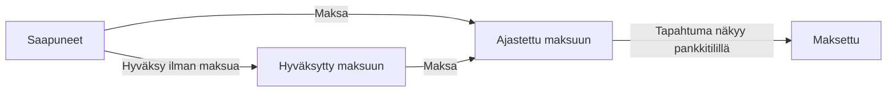

Ostolasku kulkee Risessä neljän tilan läpi: **saapunut → hyväksytty maksuun → ajastettu maksuun → maksettu**. Kaikki neljä näkyvät samassa **Maksettavat**-näkymässä, joten näet yhdellä silmäyksellä, mikä odottaa sinua ja mikä on jo matkalla pankkiin.

## Laskun elinkaari

| Tila | Mitä se tarkoittaa | Mikä vie eteenpäin |
| --- | --- | --- |
| **Saapuneet** | Lasku on Risessä, mutta sitä ei ole vielä käsitelty | Sinä hyväksyt sen |
| **Hyväksytty maksuun** | Lasku on hyväksytty, mutta maksua ei ole pantu liikkeelle | Sinä panet maksun matkaan |
| **Ajastettu maksuun** | Maksu on ajastettu ja lähtee eräpäivänä | Pankki suorittaa maksun |
| **Maksettu** | Maksu näkyy pankkitilillä | Ei mitään — lasku on valmis |

Näkymän yläreunan välilehdet — **Kaikki**, **Saapuneet**, **Hyväksytyt**, **Ajastetut** ja **Maksettu** — rajaavat listan yhteen tilaan. Jokaisen tilan kohdalla näkyy kohteiden määrä ja yhteissumma.

## Näin lasku saapuu Riseen

Tapoja on viisi. Käytä sitä, joka on sillä hetkellä nopein — kaikki päätyvät samaan **Saapuneet**-listaan.

<Tabs>
  <Tab title="Verkkolasku">
    Verkkolaskut eli eLaskut tulevat suoraan sovellukseen. Kun toimittaja lähettää laskun yrityksesi verkkolaskuosoitteeseen, se ilmestyy Saapuneisiin valmiiksi luettuna. Sinun ei tarvitse välittää mitään eteenpäin eikä avata liitteitä.

    Tämä on paras tapa vastaanottaa laskut. Pyydä toimittajiltasi verkkolaskua aina kun se on mahdollista.
  </Tab>

  <Tab title="Skannauspalvelu">
    Paperilaskut hoituvat skannauspalvelun kautta. Toimittaja lähettää laskun skannausosoitteeseen, palvelu skannaa ja tulkitsee sen, ja lasku ilmestyy Saapuneisiin samalla tavalla kuin verkkolasku.

    Ohjaa paperilaskut skannausosoitteeseen kerran, niin niitä ei tarvitse käsitellä enää käsin.
  </Tab>

  <Tab title="Magic Box">
    Lataa lasku tiedostona sovelluksen **Magic Boxiin**, niin Rise lukee sen ja tekee siitä ostolaskun. Tämä on tapa hoitaa yksittäiset PDF-laskut.
  </Tab>

  <Tab title="Puhelimen jakovalikko">
    Kun lasku on auki puhelimessa — sähköpostin liitteenä, selaimessa tai toimittajan omassa sovelluksessa — valitse **Jaa** ja sieltä **Rise**. Lasku siirtyy Riseen ilman että tallennat tiedostoa erikseen.
  </Tab>

  <Tab title="Sähköpostin edelleenlähetys">
    Lähetä laskun sisältänyt sähköposti edelleen yrityksesi Rise-osoitteeseen. Rise lukee liitteet ja tekee niistä ostolaskut.

    Kun laskut tulevat aina samaan postilaatikkoon, tee edelleenlähetyssääntö kerran — sen jälkeen laskut siirtyvät Riseen itsestään.
  </Tab>
</Tabs>

Ostolaskun voi myös luoda käsin **Ostolaskut**-valikosta. Sitä tarvitset harvoin: vain silloin, kun laskua ei ole sähköisessä muodossa lainkaan.

## Hyväksyntäkierto ja maksuunpano

Saapunut lasku menee hyväksyntäkiertoon. Kierto — kuka laskut hyväksyy ja millä rajoilla — sovitaan käyttöönotossa, ja hyväksyjä saa laskusta ilmoituksen mobiiliin.

Hyväksyminen ja maksuunpano ovat kaksi eri asiaa, jotka voi tehdä joko erikseen tai samalla kertaa:

<CardGroup cols={2}>
  <Card title="Hyväksy ja maksa kerralla" icon="bolt">
    **Maksa** hyväksyy laskun ja panee maksun matkaan yhdellä kertaa. Nopein reitti, ja se hoituu mobiilissa.
  </Card>

  <Card title="Hyväksy ensin, maksa myöhemmin" icon="circle-check">
    Lasku jää **Hyväksytty maksuun** -tilaan odottamaan, että joku panee maksun liikkeelle. Tähän kannattaa turvautua, kun lasku on asiallinen mutta maksuhetkestä päättää joku muu.
  </Card>
</CardGroup>

Avaa lasku Saapuneista ja paina **Maksa**. Näet laskun tiedot ja voit muuttaa kahta asiaa ennen vahvistusta.

<CardGroup cols={2}>
  <Card title="Maksutili" icon="building-columns">
    Valitse, miltä pankkitililtä maksu lähtee. Jos yritykselläsi on Risessä useampi tili, vaihda tili tässä.
  </Card>

  <Card title="Eräpäivä" icon="calendar">
    Muuta päivä, jona maksu lähtee. Aikaista, jos haluat maksaa heti, tai siirrä eteenpäin, kun kassatilanne niin sanoo.
  </Card>
</CardGroup>

Kun vahvistat, lasku siirtyy **Ajastettu maksuun** -tilaan ja odottaa eräpäivää.

### Dimensiot merkitään automaattisesti

Kun dimensiot on otettu käyttöön, Rise merkitsee laskurivit automaattisesti dimensioiden asetuksiin kirjatun ohjauksen mukaan. Hyväksyjän ei tarvitse tehdä mitään.

Merkintää voi korjata käsin riveittäin — hyväksynnän yhteydessä tai jälkikäteen — ja yksi lasku voi jakautua usealle projektille tai kustannuspaikalle.

<Tip>
  Katso [Dimensiot](/fi/features/dimensions): miten akselit ja arvot luodaan, miten rivi jaetaan usealle arvolle ja mistä näet, mikä jäi kohdistamatta.
</Tip>

## Maksu ja kuittaus

Ajastettu maksu lähtee pankkiin eräpäivänä. Sen jälkeen et tee enää mitään: **lasku kuittaantuu automaattisesti maksetuksi, kun tapahtuma näkyy pankkitilillä.** Rise täsmäyttää tapahtuman laskuun ja siirtää sen Maksettu-tilaan.

<Note>
  Kuittaus ei tule sekunnissa. Tapahtumat haetaan pankista neljä kertaa vuorokaudessa, joten maksettu lasku voi näkyä Ajastettu-tilassa vielä muutaman tunnin maksupäivän jälkeen. Katso [Pankkiyhteydet](/fi/features/bank-connections).
</Note>

## Ennen kuin maksaminen toimii

Laskujen vastaanotto, hyväksyntä ja kirjanpito toimivat heti. Maksun lähettäminen pankkiin vaatii erillisen **maksuvaltuutuksen** — pankkiyhteyssopimuksen ja valtakirjan, joiden käsittely pankissa kestää 1–3 viikkoa. PSD2-pankkiyhteys on pelkkä lukuoikeus eikä siirrä rahaa.

Aloita valtuutuksesta ajoissa, vaikka käytät sitä vasta viimeisenä. Ohjeet ovat sivulla [Yhdistä pankki](/fi/support/connect-bank) kohdassa _Ota maksaminen käyttöön_.

<Warning>
  Jos lasku on hyväksytty mutta maksu ei lähde, maksuvaltuutus ei ole vielä voimassa. Ota yhteyttä, niin kerromme missä paperit menevät.
</Warning>

## Liittyvät sivut

<CardGroup cols={2}>
  <Card title="Yhdistä pankki" icon="bank" href="/fi/support/connect-bank">
    Lukuoikeus ja maksuvaltuutus — kaksi eri asiaa, jotka etenevät eri tahtia.
  </Card>

  <Card title="Kulut" icon="receipt" href="/fi/features/expenses">
    Kuitit ja kululaskut. Ostolasku tulee toimittajalta, kulu syntyy omasta ostoksesta.
  </Card>

  <Card title="Dimensiot" icon="diagram-project" href="/fi/features/dimensions">
    Laskurivien automaattinen kohdistus projektille tai kustannuspaikalle — ja miten korjaat sen.
  </Card>

  <Card title="AI-kirjanpito" icon="bolt" href="/fi/features/ai-bookkeeping">
    Mitä tekoäly tekee laskulle sen jälkeen, kun se on hyväksytty.
  </Card>
</CardGroup>
